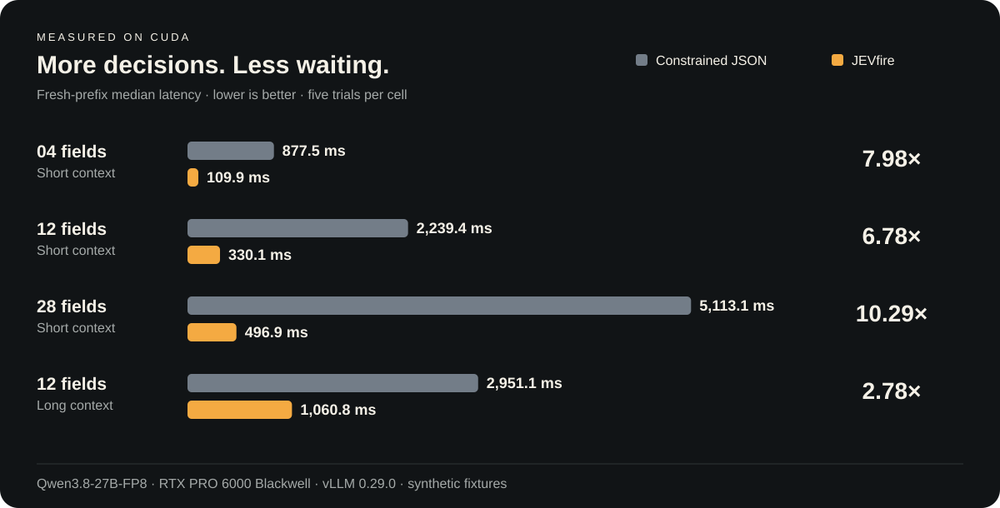
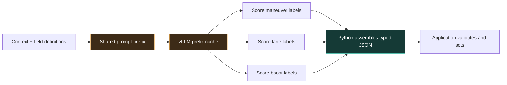

<p align="center">
  
</p>

<p align="center">
  <a href="https://github.com/kikoncuo/jevfire/actions/workflows/ci.yml"></a>
  <a href="LICENSE"></a>
  
  
</p>

<h2 align="center">28 decisions. 497 milliseconds. Same 27B model.</h2>

<p align="center"><strong>10.3× faster than generating the equivalent constrained JSON.</strong><br>
Measured median on a synthetic 28-field task with a fresh prefix.<br>
Qwen3.8-27B-FP8 · RTX PRO 6000 Blackwell · vLLM 0.29.0 · five trials per cell.</p>

<p align="center">
  <a href="#quickstart">Quickstart</a> ·
  <a href="benchmarks/README.md">Benchmarks & raw data</a> ·
  <a href="#give-your-game-an-action-layer">Game agents</a> ·
  <a href="docs/api.md">API</a> ·
  <a href="docs/deployment.md">Engine tuning</a>
</p>

JEVfire turns an existing LLM into a fast **decision API**. Give it a context
and a set of independent choices. It scores those choices through vLLM, reuses
the shared context, and assembles typed JSON in Python.

Named in tribute to **JEV**, the original inspiration behind this project.
The [JEV / RLCD demo](https://huggingface.co/harshatheg/Qwen-2.5-1B-RLCD)
inspired this independent CUDA/vLLM implementation.

**No retraining. No second model. No autoregressive JSON serialization.**

<p align="center"></p>

| Workload | Generate constrained JSON | JEVfire | Speedup |
|:--|--:|--:|--:|
| 4 fields · fresh prefix | 877.5 ms | **109.9 ms** | **7.98×** |
| 12 fields · fresh prefix | 2,239.4 ms | **330.1 ms** | **6.78×** |
| 28 fields · fresh prefix | 5,113.1 ms | **496.9 ms** | **10.29×** |
| 28 fields · warm prefix | 5,112.8 ms | **346.3 ms** | **14.77×** |
| Long context, 12 fields · fresh prefix | 2,951.1 ms | **1,060.8 ms** | **2.78×** |

The baseline uses compact, grammar-constrained JSON with thinking disabled;
JEVfire uses the same weights and thinking setting. These are selected
results from the [initial 260-request experiment](benchmarks/initial.md).
Fresh means a new prefix-cache salt, with model weights and kernels already warm.
All fixtures and individual timings are [published](benchmarks/results/benchmark.json).

> **What the headline means:** independent boolean/enum decisions on synthetic
> fixtures, not arbitrary JSON generation. Five samples per cell are an initial
> latency estimate. A separate 2,622-request tuning campaign had zero request
> errors and exact matches throughout; those are repeated fixtures, not 2,622
> independent examples. [Methodology, full results, and limits →](benchmarks/README.md)

## Why it works

Traditional structured generation emits keys, punctuation, and values token by
token. JEVfire maps each field's options to verified single-token labels,
asks vLLM for their scores, and picks the best label for each field. Your
application gets a JSON object without asking the model to spell it out.



vLLM owns CUDA execution and KV state. JEVfire is a lightweight HTTP sidecar;
it does not load another copy of the model. Each field/chunk scores one output
position. Engine scheduling can still require multiple batches and forward passes.

| Capability | Constrained JSON generation | JEVfire |
|:--|:--|:--|
| Output work | Autoregressively emit the object | Score labels; assemble the object in Python |
| Boolean / finite choices | Yes | **1–64 fields; up to 255 choices each** |
| Arbitrary prose, nested schemas, dynamic arrays | Supported when model/backend permit | Current API accepts flat finite fields |
| Cross-field reasoning | Later values can condition on earlier values | Fields are scored independently |
| Model changes | No training required | **No training required** |
| Failure handling | Validate generated output | Reject incomplete/nonfinite scores; no silent default |
| Performance sweet spot | Flexible generative content | **Many independent decisions sharing context** |

## Give your game an action layer


*Concept artwork, not a gameplay capture or benchmark.*

Use an LLM to drive **high-level decisions in a real-time game**: choose a racing
maneuver, a lane, or whether to activate a boost. The game engine keeps rendering
and running physics while an asynchronous decision loop updates its action state.
Our measured latencies suit slower tactical ticks, not a claimed 60 Hz control loop.

```json
{
  "context": "Simulated race: tight bend ahead, low grip, lane clear, boost charged.",
  "schema": {
    "maneuver": {
      "type": "enum",
      "description": "Choose the maneuver. Brake for tight bends with low grip.",
      "choices": ["brake", "coast", "accelerate"]
    },
    "boost": {
      "type": "boolean",
      "description": "Activate boost only on a clear straight with good grip."
    }
  }
}
```

```python
import httpx

result = (
    httpx.post(
        "http://127.0.0.1:8010/v1/decisions",
        json=request,  # the object above
        timeout=120,
    )
    .raise_for_status()
    .json()
)
action = result["parsed_json"]
# Apply your game's action rules before updating its state.
```

Run the included [racing simulation](examples/racing_agent.py):

```bash
python examples/racing_agent.py --steps 8
```

It calls the real endpoint, applies deterministic action guards, advances a toy
simulation, and prints measured decision latency. The game example is illustrative;
the headline benchmark measures extraction fixtures, not racing performance.

| Build | Decisions to score | Application's job |
|:--|:--|:--|
| **Racing game copilot** | Maneuver, lane, boost | Enforce collision/boost rules; advance simulation |
| **NPC tactics** | Attack/retreat, target ID, ability | Check cooldowns and legal action combinations |
| **Tool-using agents** | Tool, urgency, confirmation flag | Validate arguments and permissions; execute tools |
| **Interactive worlds** | Animation, emote, dialogue intent | Map choices to authored assets and behavior |
| **Workflow routing** | Queue, intent, independent tags | Run your existing workflow or graph branch |
| **Document extraction** | Known categories, explicit facts | Handle unknowns and evaluate accuracy |

The endpoint selects actions; your application executes them. Related decisions
need application rules or sequential stages. A [tool-routing example](examples/tool_router.py)
shows how to assemble fixed nested JSON after scoring.

## Quickstart

**Requires Python 3.11+ and an existing compatible vLLM CUDA server.** The tested
backend is vLLM 0.29.0 with Qwen3.8-27B-FP8. Other models need tokenizer, template,
accuracy, and performance checks. [Start the tested backend →](docs/deployment.md)

```bash
git clone https://github.com/kikoncuo/jevfire.git
cd jevfire
python -m venv .venv
source .venv/bin/activate
python -m pip install -e '.[dev]'

export DECISION_VLLM_URL=http://127.0.0.1:8000
export DECISION_MODEL=qwen3.8-27b
export DECISION_TOKENIZER=Qwen/Qwen3.8-27B-FP8

python -m uvicorn jevfire.app:app --host 127.0.0.1 --port 8010 --no-access-log
```

In another terminal:

```bash
curl --fail-with-body http://127.0.0.1:8010/v1/decisions \
  -H 'Content-Type: application/json' \
  --data-binary @examples/racing-request.json
```

Explore Swagger at **http://127.0.0.1:8010/docs**. `/health` reports the served model
and active candidate-score limit. The sidecar downloads only the tokenizer if it
isn't cached. Keep it matched to your served model revision.

Stock settings work without an engine patch. For the measured cache behavior,
configure the **verified cache block size for your deployment**. For 129–255
choices in one call, use the optional, version-checked
[256-score patch](docs/deployment.md#optional-256-score-patch).

## The two optimizations that mattered

**Cache the right boundary.** On the tested hybrid-attention model, aligned
prefill cut the long-context, 12-field median from **2,167 → 255 ms** with a warm
prefix: **8.51× versus ordinary batched scoring**. The fresh-prefix improvement
was **2.77×**. These are cache-strategy comparisons, separate from the JSON table.

**Score more candidates per call.** The optional vLLM 0.29 patch raises the
requested-score cap from 128 to 256. Warm 255-choice throughput rose from
**3.85 → 7.54 requests/s**, **1.96× versus the two-call scoring path**, with identical
raw scores in the recorded probes. Against JSON on the same engine, the patched
path was **23% faster warm** and **slightly slower fresh** at concurrency four.

Increasing the batch-token budget from 2,096 to 4,096 or 8,192 did **not** give a
consistent improvement and reduced available KV cache by about 17–18% under
the fixed memory allocation. [All tuning experiments →](benchmarks/tuning.md)

## Boundaries worth understanding

- **Finite outputs:** booleans or 2–255 string choices per field. No arbitrary
  prose, generated array length, nested request schemas, or unbounded numbers.
  Your code can wrap returned fields into fixed nested objects/arrays.
- **Independent fields:** values do not condition on sibling answers. Encode a
  joint action as one enum or stage dependent decisions sequentially.
- **Uncalibrated scores:** relative label probabilities are not probabilities
  that an answer is correct. Surrogate labels and option order can introduce bias.
- **New context still costs compute:** longer prompts require prefill; cache reuse
  helps only where prefixes match and the engine can reuse them.
- **Latency is not your bill:** measured speedups do not imply identical throughput,
  energy, or dollar savings. Published energy estimates cover a shared GPU.
- **Experimental release:** representative task accuracy and other models still
  need evaluation. Include an explicit `unknown` choice when evidence can be absent.

## Explore the repo

| Start here | What you'll find |
|:--|:--|
| [API reference](docs/api.md) | Request/response contract, strategies, errors, abstention |
| [Deployment](docs/deployment.md) | CUDA backend, cache configuration, optional patch and rollback |
| [Benchmarks](benchmarks/README.md) | Reproduction commands, complete data, methodology |
| [Scoring engine](jevfire/core.py) | Shared prompts, verified labels, score merging, typed output |
| [Tests](tests) | CPU contracts and opt-in live CUDA checks |
| [Artwork](docs/art-direction.md) | Original artwork, generation prompts, reproducible chart |

Inspired by **JEV** and [harshatheg's RLCD demo](https://huggingface.co/harshatheg/Qwen-2.5-1B-RLCD).
Built with [vLLM](https://github.com/vllm-project/vllm), FastAPI and Hugging Face
tokenizers. Independent project; see [third-party notices](THIRD_PARTY_NOTICES.md).
Code is [MIT licensed](LICENSE).

<p align="center"><strong>Spend tokens on decisions. Let code build the JSON.</strong></p>
