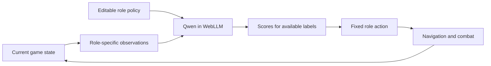

# Spatial context and survival policies

Last Hearth asks the model to choose one available role action for one villager.
Code supplies observations, selects a legal target for the chosen behavior,
navigates, and resolves combat. The model does not output XY coordinates, invent
entity IDs, or generate an executable plan.

## Make geometry explicit

Rounded distances and compass bearings describe spatial relationships. Time to
home and time until starvation help the model decide to eat before the return
journey becomes fatal. Collectors see route danger and round-trip estimates.
Fighters see allies/buildings already under attack. Builders see damage and
remaining defense sites and wounded allies. Unrelated details are omitted to
reduce prefill.

Click a villager to see its exact current context. The information comes from
simulation state, without a vision call or fog-of-war mechanic. The nearest-orc
subset limits prompt size; it does not model realistic perception.

`reaches_me_seconds` estimates a direct approach at the orc's current speed. It
does not predict that an orc will change targets or account for every detour.
Route risk measures proximity to current orcs; movement after observation can
invalidate it. Safer routing is not invulnerability. Taunts work only within
the game's specified range.

## Put dependent behavior inside one action

Independent `attack`, `target`, and `taunt` fields could form an incoherent
combination. Instead, `defend` selects that behavior as a whole. The game chooses
a threatening orc, approaches, taunts, and attacks. Similarly, `forage_safe`
includes harvesting and the return trip. These are defined game mechanics, not
an invisible policy replacing a bad model choice.

Basic needs are a visible game rule: at 28 hunger, a villager temporarily stops
its job, travels to real food, eats, and resumes the requested work. Shared meals
and builder treatments consume supplies. The inspector distinguishes the model's
requested job from automatic self-care; meals and single-option rules never
count as AI ticks. Zero hunger still kills, and an empty world cannot feed anyone.

The candidate set excludes nonexistent work: no repair without a damaged
standing building, no healing without a patient and stored food, no defense
without a live orc. Relaxation is available for fatigue, hunger, wounds, an
unfinished break, or when no productive job remains. Stamina drains during
work and recovers at home; character-specific break thresholds are explicit
game rules. A healthy, fed, rested builder returns to useful available work.
A stale result is rejected if
its job has become unavailable or the actor is now eating. Dead actors receive
no commands. These constraints guarantee a legal action, not a wise one.

## Tune with evidence

Keep seed and simulation speed fixed, then change one role policy at a time.
Maintaining food reserves, interrupting
training to protect allies, and balancing repair against new defenses are useful
priorities. Independent choices can still conflict: six sensible eating choices
may empty the pantry faster than two collectors replenish it.

The [policy fixtures](../web/qa/policy-fixtures.json) cover urgent hunger, peaceful
work, threatened allies/buildings, and construction. They are small scenario
checks, not a representative intelligence benchmark. The
[scripted balance runs](../web/qa/balance-results.json) exercise multiple seeds
using explicit rules. They do not measure Qwen or establish globally optimal
prompts. Seeds fix random events, while model arrival times and frame cadence
can also alter gameplay.

One browser engine processes one actor at a time. The next actor receives fresh
observations after the previous call completes. Round-robin scheduling prevents
eligible roster members from being skipped. Actors busy with automatic meals are
not scored, and single-choice states use an explicit rule without a model call.
Pauses, resets, and instruction edits
invalidate pending results. A result can still describe a slightly older world
by the time inference completes; this delay is part of the challenge and appears
in the timing counters.

The formatter spells out the direction of the food meter, empty repair lists,
current attack targets, and travel estimates in plain language. The inspector
shows those same facts. Role instructions remain editable. Experiments with
extra examples, explicit thresholds, semantic labels, and a 2B model did not
establish a reliable survival improvement. The earlier 0.8B policies missed
important actions; [recorded results](../web/qa/README.md) include failures.
Those scene results predate the current needs and healing rules. The new character
prompts give Mira a cautious style, Bram a preference for leisure, Aldric a
protective role, Sable an appetite for training, Tomas a focus on construction,
and Nell a focus on treatment. They are prompt instructions, not guaranteed
behavior or an optimal controller.

## Input truth and output structure differ

Last Hearth reads numeric state directly. An image-based application can first
ask a vision model to describe a scene and then use JEVfire to score finite
actions. Perception errors remain possible even when output fields are exact.
[Image example and current runtime limits](image-context.md).
