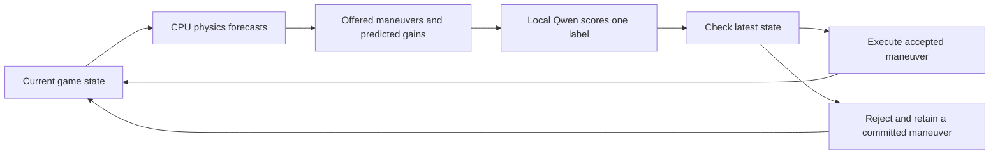

# Continuous Mario control with local Qwen

The fast Mario controller combines **Qwen maneuver selection with an explicit
local physics guard**. The game keeps moving while the browser scores the next
choice. Qwen chooses an offered maneuver; application code predicts hazards,
filters candidates, checks the answer against the latest state, and times the
buttons needed to execute it. Any completion result belongs to this whole system.
It would not demonstrate that an unaided language model learned to play Mario.

[Play the browser demo](https://kikoncuo.github.io/jevfire/mario.html) ·
[Game and controls](mario-demo.md) · [Browser SDK](browser-sdk.md)

## Why change the control interface?

The original controller independently scored direction, jump and speed. That is
a useful demonstration of three typed fields sharing one observation, but a
platformer also needs consistent actions over time. A jump requires a fresh
press, a suitable hold, and a release before another takeoff. Repeatedly choosing
`jump: true` does not produce repeated jumps. The
[recorded raw-control run](../web/qa/mario-check-result.json) exposed exactly this
failure, including held-jump decisions after landing.

The fast interface asks for one bounded maneuver, such as `run`, `walk`, `hop`,
`jump`, `jump_walk`, `brake` or `retreat`. A verified single-token label selects
one value, and JavaScript assembles `{ "maneuver": "jump" }`. The executor
translates that choice into direction, speed and timed jump input. These timing
rules are declared application behavior, not additional model decisions.

This follows the general control-system idea of executing an action over time
while the next decision is computed. Research on asynchronous action chunking
addresses the same latency problem. Black, Galliker and Levine's
[Real-Time Execution of Action Chunking Flow Policies](https://arxiv.org/abs/2506.07339)
uses inpainting of diffusion/flow-policy action sequences. This demo does not
implement that algorithm: it uses a fixed maneuver library, categorical Qwen
scores and a local simulator. The paper motivates overlap and continuity; its
robotics results are not evidence for this game's performance.

## Who decides what?

The predictor first advances a private copy of the current state through an
estimated inference delay, continuing the active maneuver. It then simulates
candidate maneuvers for a **1.6-second forecast horizon**. The model-facing prompt
contains a bounded subset of candidates that forecast no death or damage and a
supported landing, together with their predicted forward gains in tiles. Qwen
receives these computed summaries, not screen pixels or the full scene geometry.
This is substantial assistance from the game engine.

The model chooses among those options using its editable instructions. When only
one survives, the choice has no remaining strategic freedom; the interface
reports single-option selections. An empty candidate set does not invoke the
scripted player. Existing execution and waiting/braking behavior remain explicit.

An answer is checked again when it arrives. Pause, reset and policy/controller
changes invalidate old requests. A maneuver that is no longer predicted safe is
rejected; the guard can retain an already committed maneuver or brake if none is active. Accepted jumps press once, hold for the maneuver's duration and
release. Short movement maneuvers expire rather than driving forever after a
late response. Rejected selections and waiting stops are observable separately
from accepted AI updates.

The predictor uses the game's actual collision and enemy simulation on cloned
state. It contains no stored route through level coordinates, and the model path
does not call the scripted controller. It nevertheless has privileged access to
the simulator and predicts consequences for the model. A successful run should
therefore be described as **Qwen plus a physics guard**, with guard involvement
reported alongside it. A finite horizon, latency estimation errors and changing
state can still cause failures; “predicted safe” is not a guarantee.

## What reduces inference work?

The browser uses the pinned Qwen3.5 0.8B model through WebLLM. WebLLM supplies
browser-local inference using WebGPU, WebAssembly and compiled kernels; a worker
keeps inference orchestration away from the UI thread. Worker execution does not
create another physical GPU. See the
[WebLLM paper](https://arxiv.org/abs/2412.15803) and
[official worker documentation](https://webllm.mlc.ai/docs/user/advanced_usage.html).

The fast path makes three changes:

- **One scored position per maneuver.** The model selects one categorical value
  instead of separately evaluating three field suffixes. This changes the action
  interface and prompt, so its end-to-end improvement cannot be attributed to
  caching alone.
- **Persistent instruction caching.** The unchanged instruction/policy prefix is
  checkpointed across updates. Fresh candidate labels and forecast gains remain
  after that prefix and are evaluated on every request. Exact token comparison
  prevents an edited policy from reusing incompatible state. Attention and
  recurrent state must both be restored.
- **Continuous scheduling.** The next live request starts after the previous
  answer is handled, with one request outstanding. The previous 0.30-second
  post-answer wait is absent from Live mode. Maneuver scoring uses 256-token
  submissions with zero artificial yield delay. The world and button executor
  continue while inference runs; a waiting stop is different from paused physics.

The advanced raw-button controller remains available for comparison. Its
three-field request can use the SDK's optional `stablePrefix`: one checkpoint
preserves instructions across observations, and another shares the current
observation across fields. Earlier field answers never enter later fields'
context. With fewer than two cache slots, this falls back to ordinary shared
prefix caching. Unsupported optimized adapters use independent prefills and
report zero cache reuse. The optional raw **Decision steps** mode is a diagnostic
that pauses physics at action boundaries, not the default continuous controller.

The SDK always constructs declared fields from finite typed values. This blocks
invented output keys and undeclared maneuvers. It does not establish good
judgment, calibrated confidence or successful platforming. The label percentages
are relative scores within the offered set.

## Comparisons that answer different questions

| Comparison                                                    | What it isolates                               | What must remain the same                                                          |
| ------------------------------------------------------------- | ---------------------------------------------- | ---------------------------------------------------------------------------------- |
| Raw controls, cache off vs shared observation cache           | Repeated observation work across three fields  | Full prompt bytes, field labels, model, chunks and snapshots                       |
| Raw shared cache vs layered `stablePrefix`                    | Instruction reuse across changing observations | Same observation sequence and full prompt bytes; at least two slots                |
| Maneuvers, cache off vs persistent prefix                     | Reuse within the fast controller               | Same candidate forecasts, policies, labels and chunk size                          |
| Raw three-field vs maneuver controller                        | Whole-controller latency and behavior          | Hardware and game conditions; disclose the changed prompt, guard and action space  |
| Live vs Decision steps                                        | Effect of world movement during inference      | Controller/policy where supported; distinguish wall time from simulation time      |
| Qwen choice vs an explicitly labeled forecast-greedy baseline | Added value of the model over the predictor    | Same offered candidates, executor and guard; rule choices count as zero AI updates |

Alternate cache-on/off order, warm the model first, and use changing snapshots.
Repeating one frozen observation mainly tests an already-cached world. Retain
raw logits, selected values, input/processed/cached tokens and any disagreement;
GPU numerical differences can change near-tied winners. Separate worker latency
from CPU forecast time and total observation-to-application latency. A cache
savings percentage is a token-work measurement, not a latency multiplier.

## Measurements

**71 ms per action on an M4 Max** is the rounded headline for the final-build
run: **71.26 ms mean worker inference**, **511 accepted choices**, and **40.12 s
wall-clock completion**. The device owner identified the hardware as an M4 Max;
the saved WebGPU telemetry itself records only Apple / Metal 3, not the chip SKU.
This hardware attribution does not change the original measurement files.
The figure excludes model download and CPU forecasting, and is not the full
observation-to-action latency. [Visual explanation and receipts](https://kikoncuo.github.io/jevfire/learn.html#results).

The four-run mean below remains **72.79 ms**. A final-build run and an aggregate
are different statistics; the 71 ms headline is not a replacement for that mean.

The hybrid controller completed **4 of 4 recorded continuous runs**, with
**12.60 accepted AI updates per wall second** across 1,936 accepted choices.
These are local results on one authored level, not a general success-rate
estimate. The browser reported an **Apple / Metal 3** WebGPU adapter and
**Chrome 152**; its GPU device/description fields were empty. The model was
Qwen3.5-0.8B-q4f16_1-MLC, revision
`0ec138972555613c1d7812a821778ad0398c8790`, on WebLLM 0.2.85.
[Environment, aggregate statistics and model pins](../web/qa/mario-fast-results.json).

| Measurement                            | Recorded result                                                                     |
| -------------------------------------- | ----------------------------------------------------------------------------------- |
| Completed runs                         | 4/4; 37.01–39.94 simulation seconds, 37.12–40.12 wall seconds                       |
| Accepted AI choices                    | 1,936; 12.60/sec, one scored position per accepted maneuver                         |
| Worker latency, accepted choices       | Mean 72.79 ms; median 71.80 ms; p95 94.50 ms                                        |
| Request round-trip, accepted choices   | Mean 74.80 ms; median 73.20 ms; p95 99.80 ms                                        |
| First choice with a cold policy prefix | 201.40 ms in run 1; 192.80 ms in run 4; excludes model download                     |
| CPU candidate forecasting              | Mean 2.52 ms across 2,007 forecasts, reported separately from request round-trip    |
| Token work, accepted choices           | 300,205 logical input-token evaluations; 185,664 reused (61.85%); 114,541 processed |
| Physics-guard involvement              | 97 single-option selections; 14 stale selections rejected; 0 waiting stops          |
| Rendering                              | Per-run means of FPS snapshots 55.1–55.5; worst observed frame interval 83.4 ms     |

Accepted-update statistics exclude rejected answers; those answers still required
model work. Physics steps and guard interventions do not count as AI updates.
Request round-trip begins after candidate forecasting, so it is not the complete
cost from reading game state to applying a control.

The first three runs used the same gameplay/controller logic before the final
uncached-baseline and UI-probe fixes. **Run 4 used the exact shipping build** and
completed in 39.94 simulation seconds, with 511 accepted choices and 71.26 ms
mean worker latency. The final worker SHA-256 is
`dcec81709f718e8e03aace2acc0d82fb54e131211158ca187cb0271a073e28a3`.
Raw traces: [run 1](../web/qa/mario-fast-run-1.json.gz),
[run 2](../web/qa/mario-fast-run-2.json.gz),
[run 3](../web/qa/mario-fast-run-3.json.gz), and
[run 4](../web/qa/mario-fast-run-4.json.gz).

### Paired cache measurements

The final ablation used six raw-control observations from the earlier failed run
and twelve maneuver forecasts sampled from the first continuous run. These test
compute reuse and choice agreement, not held-out policy quality.

| Interface and cache setting                      | Pairs/scenes | Mean worker latency | Processed / logical input tokens |
| ------------------------------------------------ | -----------: | ------------------: | -------------------------------: |
| Three raw fields, independent prefills           |            6 |         1,425.32 ms |                    8,601 / 8,601 |
| Three raw fields, shared observation             |            6 |           615.18 ms |                    3,513 / 8,601 |
| Three raw fields, layered stable + shared prefix |            6 |           471.73 ms |                    2,457 / 8,601 |
| One maneuver, cache disabled                     |           12 |           140.17 ms |                    1,869 / 1,869 |
| One maneuver, persistent instruction cache       |           12 |            67.32 ms |                      717 / 1,869 |

For the same maneuver prompts, persistent caching was **2.08× faster** by the
ratio of means, with **12/12 choices agreeing**. The raw-control variants agreed
on all three fields in **6/6 scenes**. Sharing the raw observation was 2.32×
faster than independent prefills; adding the stable instruction layer was a
further 1.30× over shared caching. These are small paired measurements on this
device, with the tested prompts and chunk settings.
[Full ablation inputs, logits, timings and token counts](../web/qa/mario-cache-ablation-result.json).

The roughly ninefold difference between shared raw controls and cached maneuvers
is **not a cache-only speedup**. The interfaces, prompt lengths, state summaries,
field counts and fixture sets differ. The same-prompt 2.08× comparison isolates
the maneuver cache contribution; the live runs measure the complete controller.

An earlier ablation split uncached prompts at a checkpoint boundary even though
no checkpoint was requested, adding an unnecessary forward/synchronization.
The final comparison fixes this: all twelve uncached maneuver prompts and their
twelve cached counterparts each use one forward call. The superseded
[preliminary record](../web/qa/mario-cache-ablation-preliminary.json.gz) is retained
for provenance and is not the basis for these claims.

A CPU-only controller that picks the greatest predicted progress can also clear
the level in the [maneuver regression tests](../web/test/mario-maneuvers.test.js).
The four Qwen completions therefore demonstrate a working, prompt-controlled
hybrid integration—not Qwen's superiority over that predictor or a requirement
for an LLM to solve this level.

## Further experiments, not implemented optimizations

The adapter still reads the full vocabulary row before extracting candidate
scores and still synchronizes each GPU submission. A GPU gather could reduce
readback to the offered labels; it would not eliminate the language-model head.
Changing synchronization requires checking buffer lifetimes, checkpoint ordering
and numerical equivalence. The
[pinned model configuration](https://huggingface.co/mlc-ai/Qwen3.5-0.8B-q4f16_1-MLC/blob/0ec138972555613c1d7812a821778ad0398c8790/mlc-chat-config.json)
has 248,320 vocabulary entries and a 1,024-token compiled prefill size. Larger
submissions may trade lower inference overhead for longer UI stalls.

A smaller model is another experiment, not an assumed improvement in gameplay.
The [official WebLLM model catalog](https://github.com/mlc-ai/web-llm/blob/main/src/config.ts)
includes smaller Qwen and SmolLM variants. They require matched tokenizers and
compiled libraries, fresh policy tests and measured latency. Another runtime is
a larger change: ONNX Runtime's
[WebGPU graph capture and GPU tensor binding](https://onnxruntime.ai/docs/tutorials/web/ep-webgpu.html)
have concrete shape, kernel and memory requirements; switching runtimes alone
does not establish a speedup.

Implementation: [maneuvers and forecasts](../web/src/mario/maneuvers.js),
[compact prompt](../web/src/mario/maneuver-prompt.js),
[live scheduling](../web/src/mario/main.js),
[inference worker](../web/src/inference.worker.js), and
[SDK cache logic](../web/src/sdk/finite-decisions.js).
